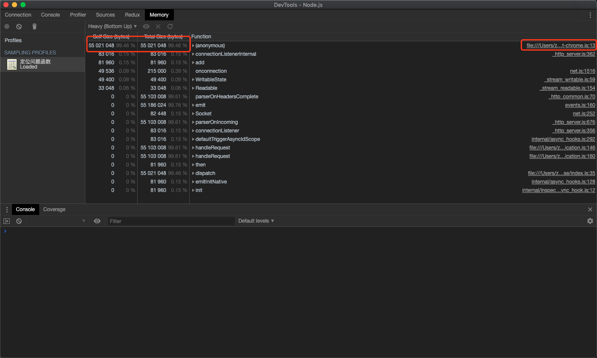

# node.js 内存泄漏问题定位项目

首先，打开 Chrome Devtools 里的 Memory 面板，用以监控我们的程序内存性能。

调试方法：

* 以 inspect 方式启动 node 应用： `node --inspect-brk app.js`
* 在 `chrome://inspect`中找到对应 node.js 应用并注入（inspect）调试工具
* 启动压测脚本： `while true;do curl localhost:3000;done` 或 `ab -c 100 -t 10 http://localhost:3000/`
* 到开发者工具中进行相关监测

## 1. 使用(HeapDump)堆快照发现已分离 DOM 

首先，选中 `Heap snapshot` 选项，在程序运行的任何时刻拍摄快照

按照`Retained Size`（分配得到的内存）排序，查找内存占有率较大的异常实例，即可定位到撑满内存的变量：

也可以拍摄多张快照，进行对比:

* 选中一个座位参照基准的 HeapShot
* 打开下拉菜单并选中`Comparison`
* 在选择一个进行对比的 snapshot
* 按`Delta`排序，即可知道变化最大的内存实例

## 2. 按函数执行产出调查内存分配

目前，我们已经知道了发生内存泄漏的对象实例，如何定位产生这些实例的具体代码呢？

首先，我们回到 Memory Tab 初始页，这回点选 `Allocation sampling`，启动应用并录制一段引发内存泄漏的内存录像

可以看到有一个匿名函数（anonymous）分配了大量的内存空间，而右边即是对应代码的位置，点击即可实时跳转

